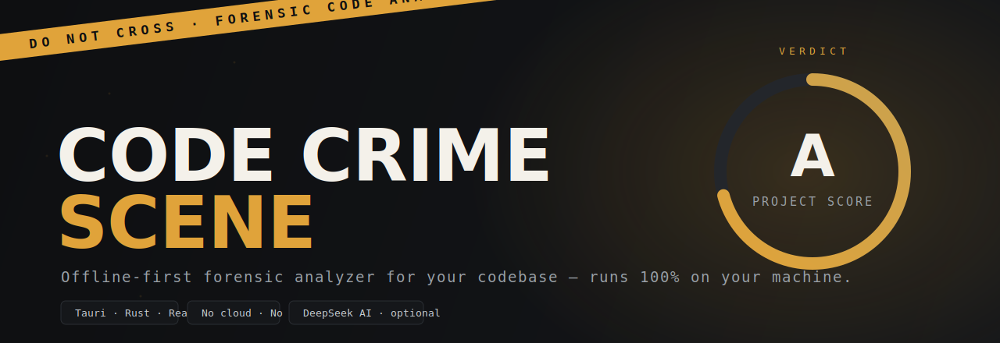
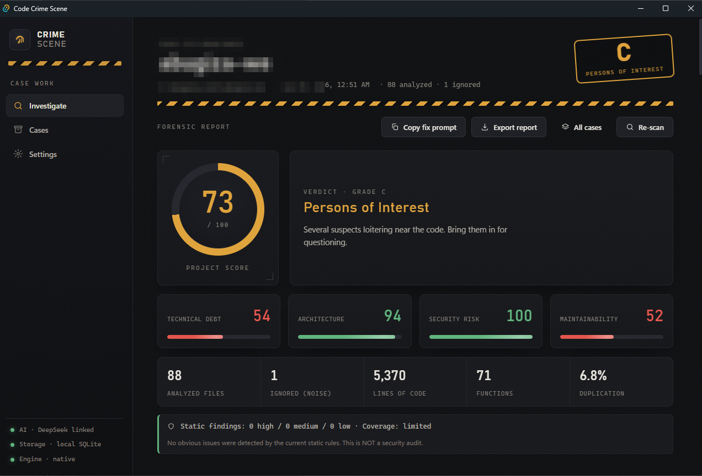
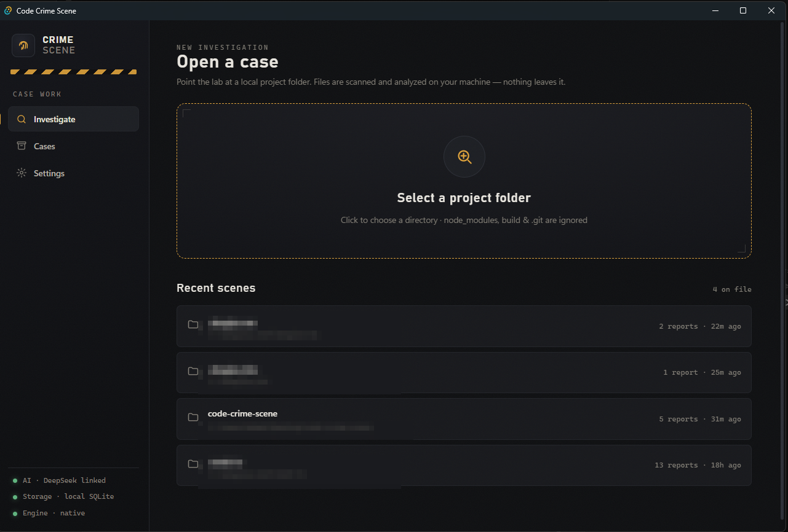
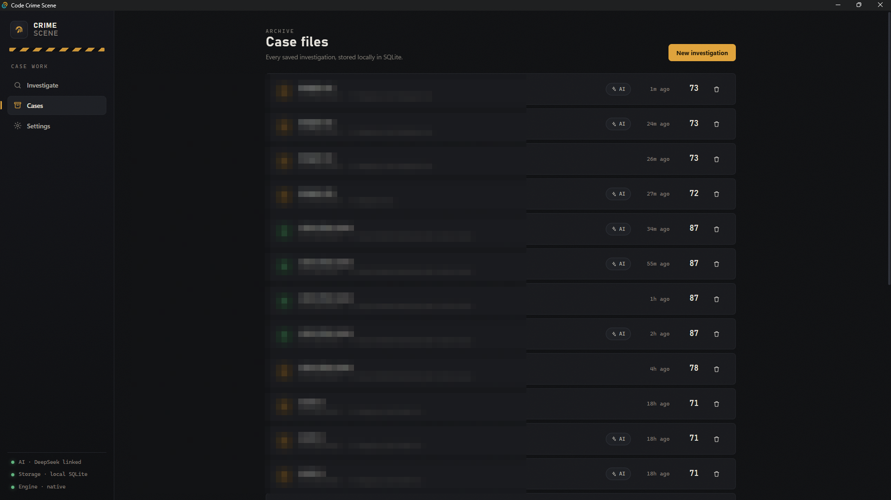
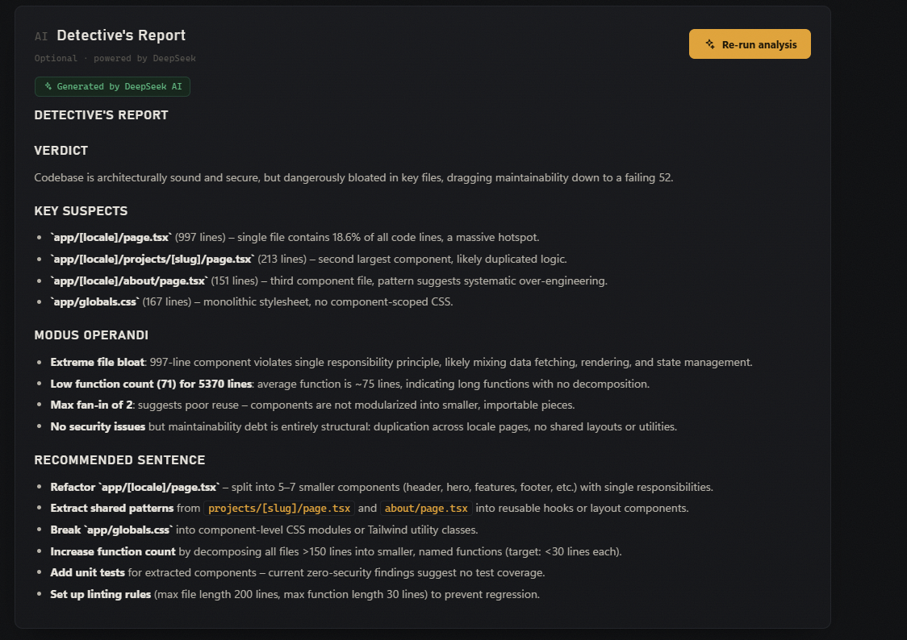
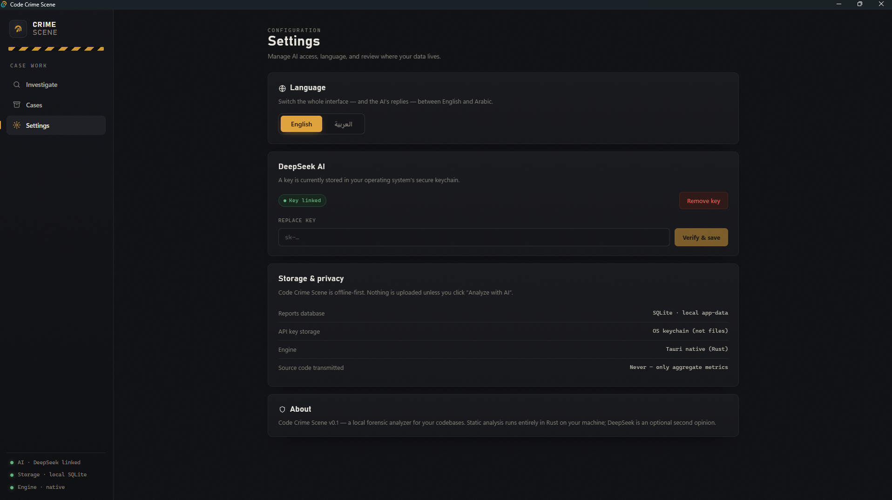
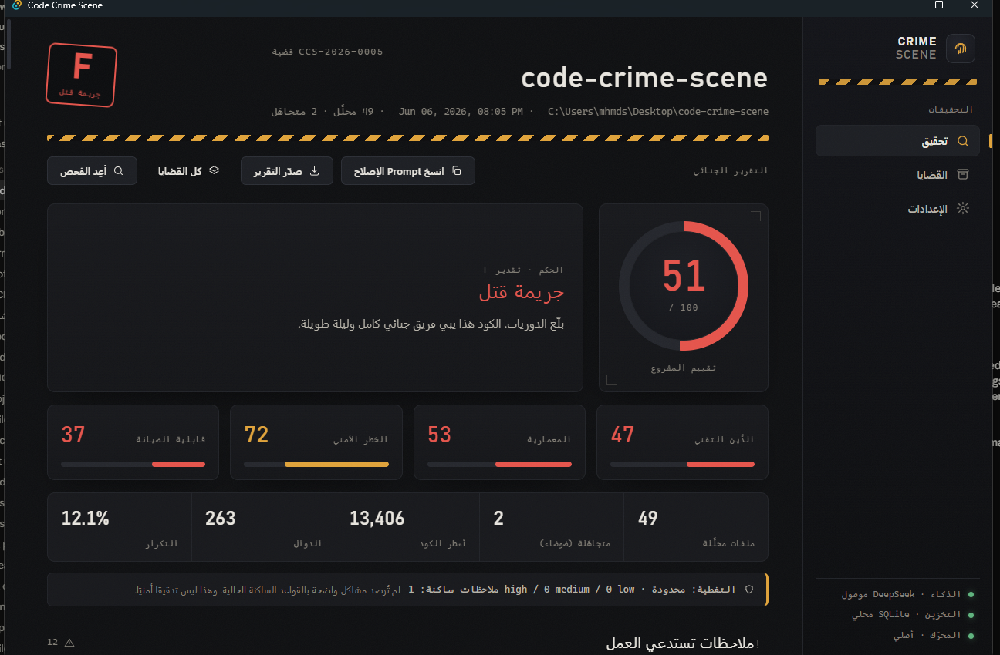
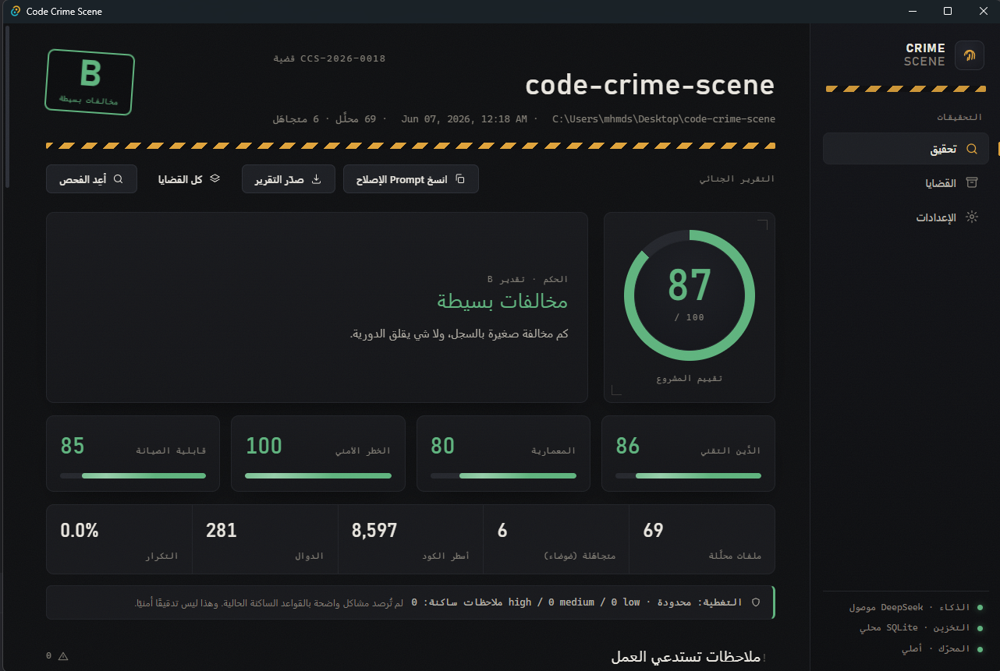
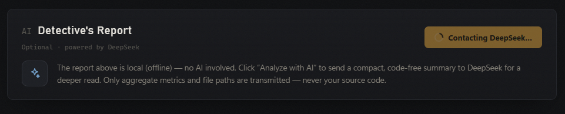

<p align="center">
  
</p>

<h1 align="center">Code Crime Scene</h1>

<p align="center">
  <b>An offline-first desktop app that treats your codebase like a crime scene.</b><br>
  It scans a local project, dusts it for fingerprints, and hands you a forensic report —
  scores, suspects, and a prioritized list of fixes. Everything runs on your machine.
</p>

<p align="center">
  
  
  
  
  
</p>

<p align="center"><a href="README.ar.md">🌍 اقرأ بالعربية</a></p>

---

## What it is

**Code Crime Scene** is a local, single-binary desktop tool for developers and teams who want an honest, fast read on the health of a codebase — without uploading a single line of source to the cloud.

You point it at a folder. A Rust engine walks the tree, runs static analysis entirely on your machine, and produces a **"Forensic Noir" report**: five headline scores, a graded verdict, and a list of **actionable findings** — each with evidence (file + line + a one-line snippet), a numeric risk rationale, and a safe, PR-by-PR refactor plan.

A second, **optional** opinion is available: send a compact, **code-free** summary to **DeepSeek** for a written "Detective's Report." Your source code never leaves the machine — only aggregate metrics and file paths are transmitted, and only when you explicitly ask.

> **Offline by default. AI by choice.** The scan is 100% local. DeepSeek is only contacted when you press **"Analyze with AI."**

---

## Highlights

| | |
|---|---|
| 🔒 **Offline-first** | No backend, no login, no telemetry. Static analysis runs locally in Rust. |
| 🧠 **Optional AI** | DeepSeek gives a deeper, written read — on request, with a code-free summary. |
| 🎯 **Evidence-ranked findings** | Real usage beats imports/types/comments. Every finding cites file, line, and a snippet. |
| 📊 **Five scores + verdict** | Project Score, Technical Debt, Architecture, Security Risk, Maintainability. |
| 🧩 **Context-aware** | Knows a hook from a server entrypoint from an icon file; suggests fixes that fit the file. |
| 🩹 **Safe refactor plans** | Each finding ships a PR-by-PR slicing plan + the exact `npm run` verify commands. |
| 🌍 **Bilingual** | Full English / Arabic UI (RTL), and the AI replies in your chosen language. |
| 🔑 **Keys in the OS keychain** | Your API key lives in Windows Credential Manager — never in a file, never in the webview. |
| 🗄️ **Local history** | Every report is saved to a local SQLite database you can reopen anytime. |

---

## A look inside

<p align="center">
  
</p>
<p align="center"><sub><i>The case file: five scores, a graded verdict, and a prioritized list of findings — each with evidence.</i></sub></p>

<table>
  <tr>
    <td width="50%" align="center" valign="top">
      <br>
      <b>Open a case</b><br>
      <sub>Point at any local folder — recent scenes are one click away.</sub>
    </td>
    <td width="50%" align="center" valign="top">
      <br>
      <b>Case files</b><br>
      <sub>Every investigation, saved locally in SQLite.</sub>
    </td>
  </tr>
  <tr>
    <td width="50%" align="center" valign="top">
      <br>
      <b>Detective's Report — optional AI</b><br>
      <sub>A written verdict from DeepSeek, on request, code-free.</sub>
    </td>
    <td width="50%" align="center" valign="top">
      <br>
      <b>Settings</b><br>
      <sub>Language, key-in-keychain, storage &amp; privacy.</sub>
    </td>
  </tr>
</table>

---

## 🔁 Tested on itself — we fixed the tool *with the tool*

Most quality tools are never pointed at their own source. We pointed Code Crime Scene at **its own codebase** — and it indicted us.

The first self-scan was brutal: **51 / 100 · Grade F · "Homicide."** And it was *right*. It named real debt:

- **12.1% duplicated code** across the project
- **Monolith files** far over 400 lines — the analysis engine alone was **1,718** lines, the findings engine **770**, the i18n layer **889**, one stylesheet **922**
- A **duplicated API-key flow** copy-pasted between two screens
- A few of the engine's *own* findings that needed sharper evidence

So we did the honest thing. We clicked the report's **"Copy as prompt"** button, handed the tool's own forensic write-up to an AI pair-programmer, and fixed precisely what it named — splitting every monolith into focused modules under 400 lines, extracting the shared flows, and tightening the engine. Then we **re-scanned with the same tool**:

<p align="center"><b>51 → 87 &nbsp;·&nbsp; Grade F → B &nbsp;·&nbsp; "Homicide" → "Minor violations"</b></p>

<table>
  <tr>
    <td width="50%" align="center" valign="top">
      <br>
      <sub><b>Before</b> — caught by its own scan</sub>
    </td>
    <td width="50%" align="center" valign="top">
      <br>
      <sub><b>After</b> — same tool, re-scanned</sub>
    </td>
  </tr>
</table>

| Score | Before | After | |
|---|:--:|:--:|:--|
| **Project Score** | 51 · F | **87 · B** | ▲ 36 |
| **Maintainability** | 37 | **85** | ▲ 48 |
| **Technical Debt** | 47 | **86** | ▲ 39 |
| **Architecture** | 53 | **80** | ▲ 27 |
| **Security Risk** | 72 | **100** | ▲ 28 |
| **Duplication** | 12.1% | **0.0%** | ▼ all of it |

> If a code-quality tool can't survive its own audit, why trust its verdict on yours? Ours did — and the whole loop (scan → *Copy as prompt* → fix → re-scan) is exactly the workflow it's built to give you.

---

## How it works

```
                ┌──────────────────────── your machine ────────────────────────┐
   pick a       │                                                              │
   folder  ──▶  │   Scanner (Rust) ──▶ Static Analysis (Rust) ──▶ Report (UI)  │
                │                                   │                          │
                │                                   ▼  (only on request,       │
                │                          compact, code-free summary)         │
                └───────────────────────────────────┼──────────────────────────┘
                                                     ▼
                                          DeepSeek API (optional)
```

1. **Scan** — the folder is walked; `node_modules`, build output, `.git`, lockfiles and generated files are ignored.
2. **Analyze** — file/line metrics, long functions, duplication, unused imports, a dependency graph, and lightweight secret detection — all in Rust, all local.
3. **Report** — scores, a graded verdict, and prioritized findings with evidence and refactor plans.
4. **(Optional) Analyze with AI** — a compact summary (numbers + file paths, **never source**) goes to DeepSeek for a written report.

---

## Install

Build from source:

```bash
# prerequisites: Node 18+, Rust (stable), and the Tauri prerequisites for your OS
git clone https://github.com/ABUGIZA/code-crime-scene.git
cd code-crime-scene
npm install

npm run tauri dev      # run in development
npm run tauri build    # produce a standalone binary
```

> A prebuilt Windows binary will be published on the **Releases** page in a future update.

---

## Setting up the AI (DeepSeek)

AI is **optional** — the local report works fully without a key. To unlock the written "Detective's Report":

1. Create a key at **[platform.deepseek.com](https://platform.deepseek.com/) → API Keys** (it starts with `sk-…`).
2. Open the app → **Settings → DeepSeek AI** (or paste it during onboarding).
3. Paste the key and click **Verify & save**. The app makes a tiny real request to DeepSeek to confirm the key works, then stores it in your **OS keychain**.
4. Open any report → scroll to **Detective's Report** → click **Analyze with AI**.

<p align="center">
  
</p>

**Guarantees**
- The **"Analyze with AI"** button is hidden until a key is saved — and the backend refuses to run without one. No key ⇒ no AI call, ever.
- Your **source code is never sent**. Only aggregate metrics and file paths leave the machine, and only on that explicit click.
- The key is read **only in Rust** when calling DeepSeek; it never crosses into the web layer.

> Currently the app supports **DeepSeek only**. Adding another provider is a small, well-scoped change — see below.

---

## Extending to another AI provider (open source 💚)

The entire AI integration lives in **one file**: [`src-tauri/src/ai.rs`](src-tauri/src/ai.rs). It exposes exactly two functions:

```rust
pub async fn verify_key(key: &str) -> Result<(), String>;                 // validate a key
pub async fn analyze(key: &str, model: &str, summary: &str, lang: &str)   // get the report
    -> Result<String, String>;
```

To add **OpenAI, Anthropic, Gemini, Mistral, Ollama, a local model**, or any OpenAI-compatible endpoint:

1. Point the request at your provider's `…/chat/completions` URL (or its SDK).
2. Keep the same **system prompt** (`SYSTEM_PROMPT` / `SYSTEM_PROMPT_AR`) so the report format stays consistent.
3. Map the response back to a Markdown string.

Because the request body already follows the OpenAI chat schema (`model`, `messages`, `temperature`, `max_tokens`), most providers are just a **URL + auth-header swap**. The UI, key storage, language handling, and report rendering all stay the same. PRs that add providers (ideally behind a small `provider` selector in Settings) are very welcome.

---

## Privacy & security

- **No source code ever leaves your machine.** The optional AI call transmits only aggregate metrics and file paths.
- **No backend, no login, no analytics.** The app makes zero network calls unless you click "Analyze with AI."
- **API key in the OS keychain** (Windows Credential Manager) — never written to disk in plaintext, never exposed to the webview.
- **Reports stored locally** in SQLite under your app-data directory.
- Secret detection is a best-effort static pass — it is **not** a security audit.

---

## Architecture

A small, modular codebase (every source file is kept under ~400 lines).

```
src-tauri/src/
  analysis/        # static-analysis engine, split into focused modules
    mod.rs         #   orchestration (analyze)
    defs.rs        #   types, patterns, responsibility tiers
    detect.rs      #   runtime / artifact-type / responsibility detection
    metrics.rs     #   line + function metrics
    parse.rs       #   imports, duplication, secret scanning
  scanner.rs       # file-tree walking + noise classification
  ai.rs            # DeepSeek client (the one place to add providers)
  keychain.rs      # OS keychain access
  db.rs            # SQLite persistence
  commands.rs      # Tauri command surface

src/
  lib/             # api, scoring, findings engine (classify/refactor/verify), i18n
  views/           # onboarding, home, report (parts/dashboard/sections), settings, cases
  components/      # shared UI
  styles/          # the "Forensic Noir" design system
```

**Tech stack:** Tauri v2 · Rust · React 19 · TypeScript · Vite · SQLite (rusqlite, bundled).

---

## Roadmap

- [ ] Provider selector in Settings (OpenAI / Anthropic / Ollama / …)
- [ ] macOS & Linux release binaries
- [ ] More languages for the analyzer's responsibility heuristics
- [ ] Dependency / coupling graph visualization
- [ ] Per-rule configuration and thresholds

---

## Contributing

Issues and PRs are welcome — new AI providers, more language heuristics, and design polish especially. The static-analysis engine is guarded by Rust fixtures (`cargo test`), so behavior changes are easy to verify.

## License

[MIT](LICENSE) © mhmds — free to use, modify, and build upon.
